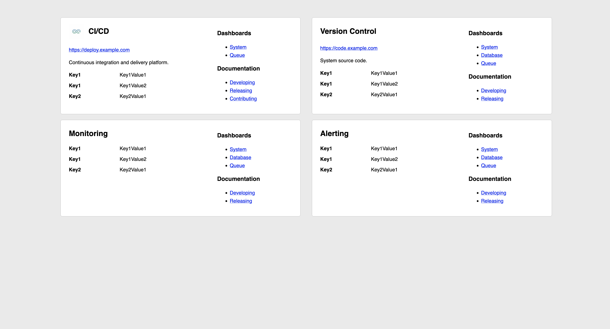

# emc

_The minimal, declarative service catalog._

Pronounced "MC" as in the master of ceremonies.

## Background

In the last three jobs I've worked at, it's always been a hassle trying to locate the various dashboards, documentation,
and support for a given project. I joined effx to try and help address just that. As I've been spinning up a new cluster,
I found myself wanting a landing page for the systems that I use regularly.

## Building your catalog

The `emc` service catalog is defined using a simple Golang script. This makes it easy for engineers to drop in their
own functionality for rendering links, link groups, or services. For an example, see the provided `grafana` package
which includes several of my personal dashboards for different systems.

```go
// catalog.go

//go:build ignore
// +build ignore

package main

import (
	"github.com/mjpitz/emc/catalog"
	"github.com/mjpitz/emc/catalog/grafana"
	"github.com/mjpitz/emc/catalog/linkgroup"
	"github.com/mjpitz/emc/catalog/service"
)

func main() {
	catalog.Serve(
		catalog.Service(
			"Drone",
			service.LogoURL("https://path/to/drone-logo.png"),
			service.URL("https://drone.example.com"),
			service.Description("Drone is a self-service Continuous Integration platform for busy development teams."),
			service.Metadata("Contact", "drone@example.com"),
			service.LinkGroup(
				"Dashboards",
				linkgroup.Link("Drone", grafana.Drone("cicd", "drone")),
				linkgroup.Link("Golang", grafana.Golang("cicd", "drone")),
				linkgroup.Link("Litestream", grafana.Litestream("cicd", "drone")),
				linkgroup.Link("Redis Queue", grafana.Redis("cicd", "drone-redis-queue")),
			),
			service.LinkGroup(
				"Documentation",
				linkgroup.Link("docs.drone.io", "https://docs.drone.io/"),
			),
		),
		// ...
	)
}
```

## Hosting your catalog

Once you've built your catalog, you can easily run a landing page by executing the catalog file.

```
$ go run ./catalog.go
```

This starts a web server for you to interact with on `localhost:8080`. If `:8080` is already in use, you can configure
the bind address by passing the `-bind_address` flag with the desired host and port.


